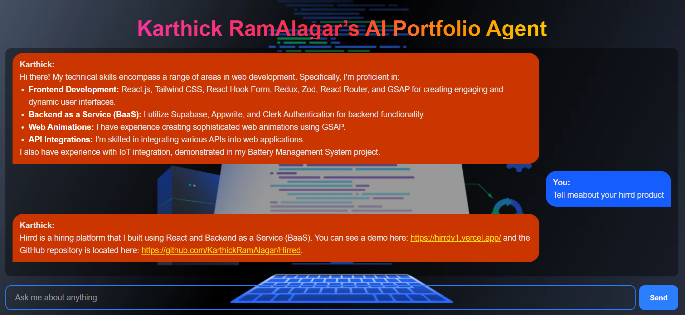

# 🤖 Karthickeyan's AI Agent — The Intelligent Next.js Assistant

<p align="center">
  
</p>

<div style="margin-top:2px">
  
  
  
  
  
  
</div>

<div align="center">
  <p>
Karthickeyan's AI Agent is a modern, AI-driven portfolio assistant built with <strong>Next.js</strong>, integrating <strong>LangChain</strong>, <strong>OpenAI</strong>, and <strong>Google Generative AI</strong> for intelligent conversations, content generation, and dynamic UI rendering.
  </p>
  <p><a href="[https://your-live-demo-link](https://karthickramalagaraiagent.vercel.app/)" target="_blank"><strong>Live Demo</strong></a></p>
</div>

---

## 📋 Table of Contents

1. [Introduction](#-introduction)
2. [Tech Stack](#-tech-stack)
3. [Features](#-features)
4. [Quick Start](#-quick-start)
5. [Installation](#-installation)
6. [Environment Variables](#-environment-variables)
7. [License](#-license)
8. [Acknowledgements](#-acknowledgements)

---

### 🚀 Introduction

**Karthickeyan’s AI Agent** is an intelligent portfolio project powered by **Next.js 15** with cutting-edge AI capabilities using **LangChain**, **OpenAI**, and **Google Generative AI**.  
This project demonstrates how AI can enhance user interaction, generate contextual responses, and support markdown rendering for a modern web experience.

---

### 🔧 Tech Stack

- ⚛ **React 19** — Latest React with concurrent rendering
- ▲ **Next.js 15** — App Router, API routes & Turbopack
- 🌈 **Tailwind CSS 4** — Utility-first responsive design
- 🧠 **LangChain** — Advanced prompt orchestration & memory
- 🤖 **OpenAI SDK** — GPT-powered natural language generation
- 🧩 **Google Generative AI** — Multi-modal AI capabilities
- 📝 **React Markdown + Remark GFM + Rehype Highlight** — Rich text rendering with code highlighting

---

## ⚙ Features

- 🤖 Conversational AI using **LangChain + OpenAI**
- 🔗 Integration with **Google Generative AI**
- 📝 Markdown support with syntax highlighting
- ⚡ Optimized performance with **Next.js App Router & Turbopack**
- 🎨 Responsive UI powered by **TailwindCSS 4**
- 🛠 Modular, production-ready architecture

---

## ⚡ Quick Start

### 📦 Prerequisites

- Node.js ≥ 18
- npm / yarn / pnpm

---

## 🛠️ Installation

Clone the repository:

```bash
git clone https://github.com/your-username/portfolio_agent.git
cd portfolio_agent
npm install
```

Start the development server:

```bash
npm run dev
```

Build for production:

```bash
npm run build
```

Run production build:

```bash
npm start
```

🔑 Environment Variables
Create a .env.local file in your project root and add the following:

GOOGLE_API_KEY=your_google_ai_api_key
ASTRA_DB_APPLICATION_TOKEN=your_astra_token
ASTRA_DB_ENDPOINT=your_astra_endpoint
ASTRA_DB_NAMESPACE=default_keyspace

🪪 License
This project is licensed under the MIT License.

## Acknowledgements

- Next.js
- LangChain
- OpenAI
- Google Generative AI
- Tailwind CSS-
- React Markdown
